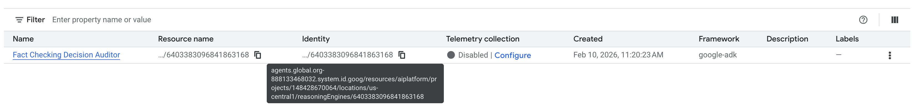
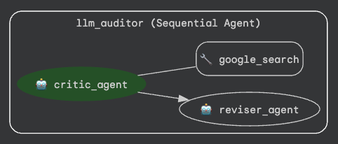
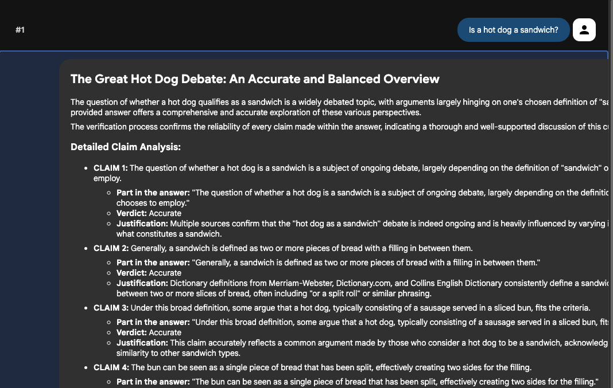

# Google Cloud Agent Engine Identity Example

## Overview
This project provides a reference implementation of a **Fact Checking Decision Auditor** agent deployed to **Google Cloud Vertex AI Agent Engine** leveraging the **Agent Development Kit (ADK)**. Ultimately, this is an identity-focused pivot of an example from Google's [ADK Samples](https://github.com/google/adk-samples/tree/main/python/agents/llm-auditor)

The primary goal of this example is to demonstrate [Agent Engine Identity](https://docs.cloud.google.com/agent-builder/agent-engine/agent-identity), showing how to deploy an agent with a dedicated identity, and how to manage its permissions. This allows the agent to securely interact with Google Cloud services using its own credentials.

The agent identity will be in the format of
`principal://agents.global.org-ORGANIZATION_ID.system.id.goog/resources/aiplatform/projects/PROJECT_NUMBER/locations/LOCATION/reasoningEngines/AGENT_ENGINE_ID` and will be visible with your deployed agent here:


## Google Disclaimer
This is not an officially supported Google implementation

### Architecture
The application implements a `SequentialAgent` that evaluates and improves the factual grounding of responses generated by LLMs. Its primary purpose is to serve as an automated fact-checking layer, analyzing LLM answers against real-world information.

1.  **Critic Agent**: Parses claims and performs verification.
2.  **Reviser Agent**: Refines the response based on the Critic's findings to ensure alignment with real-world knowledge.




## Setup Environment
```bash
# Setup Environment variables
export PROJECT_ID=
export AGENT_ENGINE_LOCATION= #e.g. us-central1
export STAGING_BUCKET= #e.g. ae-identity-agent-code (Globally Unique)

# Configure CLI
gcloud config set project $PROJECT_ID
gcloud config set billing/quota_project $PROJECT_ID

gcloud auth application-default login

# Enable APIs
printf 'y' |  gcloud services enable cloudresourcemanager.googleapis.com --project $PROJECT_ID
printf 'y' |  gcloud services enable aiplatform.googleapis.com --project $PROJECT_ID

# Create Agent Engine Staging Bucket
gcloud storage buckets create gs://$STAGING_BUCKET \
    --location=$AGENT_ENGINE_LOCATION \
    --default-storage-class=STANDARD \
    --project $PROJECT_ID
```

## Deploy the Agent

1) Verify Environment Variables

    Ensure the following variables are set.
```bash
echo "Project: $PROJECT_ID"
echo "Agent EngineLocation: $AGENT_ENGINE_LOCATION"
```

2. **Deploy Agent Engine Instance**

    Run the following code to deploy the Agent Engine instance with a dedicated identity.
```bash
# Deploy Agent Engine Stub
agent_engine_operation=$(curl -s -X POST \
    "https://$AGENT_ENGINE_LOCATION-aiplatform.googleapis.com/v1/projects/$PROJECT_ID/locations/$AGENT_ENGINE_LOCATION/reasoningEngines" \
     -H "Authorization: Bearer $(gcloud auth print-access-token)" \
     -H "Content-Type: application/json; charset=utf-8" \
    --data @- <<EOF | jq -r .name
{
"displayName": 'Fact Checking Decision Auditor',
    "spec": {
    "agentFramework": "google-adk",
    "identityType": "AGENT_IDENTITY",
    }
}
EOF)

echo "Agent Engine Operation: $agent_engine_operation"

# Get Agent Name and Identity Reference
read -r agent_name agent_identity <<< $(curl -s -X GET \
     -H "Authorization: Bearer $(gcloud auth print-access-token)" \
     -H "Content-Type: application/json; charset=utf-8" \
     "https://$AGENT_ENGINE_LOCATION-aiplatform.googleapis.com/v1/$agent_engine_operation" | jq -r ' .response.name, .response.spec.effectiveIdentity')

echo "Agent Identity: $agent_identity"
export AGENT_ENGINE_NAME=$agent_name

# Give Agent Identity Necessary Permissions
gcloud projects add-iam-policy-binding $PROJECT_ID \
    --member="principal://$agent_identity" \
    --role="roles/serviceusage.serviceUsageConsumer"

gcloud projects add-iam-policy-binding $PROJECT_ID \
    --member="principal://$agent_identity" \
    --role="roles/aiplatform.user"
```

3. **Update Agent Engine Code**

    Run the python deployment script to update the Agent Engine instance with the agent code and final configuration.
```bash
python3 -m venv venv
source venv/bin/activate
pip install -r requirements.txt
python3 deploy.py
```

The deployment can be validated in the Google Cloud console via the [Playground](https://docs.cloud.google.com/agent-builder/agent-engine/use/overview#use-deployed-agents-console) feature.

## Test Locally [Optional]

1. **Install Requirements**

    Ensure you have the necessary Python packages installed:
```bash
python3 -m venv venv
source venv/bin/activate
pip install -r requirements.txt
```

2. **Start ADK**

    Start the ADK server below, navigate to http://localhost:8000, then select `auditor` from the list of agents.
```bash
export GOOGLE_GENAI_USE_VERTEXAI=TRUE
export GOOGLE_CLOUD_PROJECT=$PROJECT_ID
export GOOGLE_CLOUD_LOCATION=us-central1
adk web .
```
